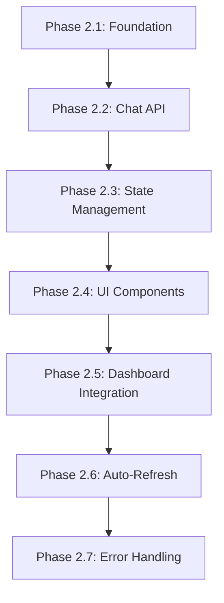

# Implementation Plan: Frontend Chat Interface

**Branch**: `007-frontend-chat-interface` | **Date**: 2026-01-30 | **Spec**: [spec.md](./spec.md)
**Input**: Feature specification from `/specs/007-frontend-chat-interface/spec.md`

**Note**: This template is filled in by the `/sp.plan` command. See `.specify/templates/commands/plan.md` for the execution workflow.

## Summary

Implement a conversational AI chat interface in the Next.js frontend that allows authenticated users to manage their tasks through natural language. The chat interface will integrate with the existing dashboard, connect to the backend chat endpoint (`POST /api/{user_id}/chat`), maintain conversation context via `conversation_id`, and automatically refresh the task list when the AI performs data modifications (detected via `tool_calls` in the response).

**Technical Approach**: Build a React component using a modern chat UI library, integrate it as a sidebar/modal in the dashboard layout, implement state management for conversation history, create an API client function for chat requests with JWT authentication, and establish an event-driven mechanism to trigger task list refresh when AI modifies data.

## Technical Context

**Language/Version**: TypeScript 5.x with Next.js 16.1.1 (App Router)
**Primary Dependencies**:
- React 19.x
- Next.js 16.1.1
- Tailwind CSS 4.x
- Chat UI Library: Custom components (OpenAI ChatKit evaluation pending - see research.md)
- Existing: `@/services/api-client.js`, `@/hooks/use-auth.ts`

**Storage**: Browser localStorage for conversation_id persistence (optional), backend PostgreSQL for conversation history
**Testing**: Manual testing (automated tests optional per spec)
**Target Platform**: Web browsers (desktop and mobile, responsive design 320px-1920px)
**Project Type**: Web application (frontend-only feature, backend already implemented)
**Performance Goals**:
- Chat message send/receive < 5 seconds
- Task list auto-refresh < 1 second after AI action
- Chat interface load < 2 seconds
- Support 100+ message conversations without degradation

**Constraints**:
- Must integrate with existing dashboard layout without disrupting task management UI
- Must use existing API client patterns and authentication context
- Must work with backend chat endpoint response format: `{conversation_id: number, response: string, tool_calls: string[]}`
- Must maintain conversation context across page refreshes (optional enhancement)
- Must be responsive on mobile devices (320px minimum width)

**Scale/Scope**:
- Single chat interface component
- 3-5 supporting components (message list, input form, message bubble, etc.)
- 1 new API client function (`postChat`)
- 1 new custom hook (`useChat`)
- Event-driven task refresh mechanism
- ~500-800 lines of new TypeScript/React code

## Constitution Check

*GATE: Must pass before Phase 0 research. Re-check after Phase 1 design.*

### Principle I: Spec-first development ✅
- **Status**: PASS
- **Evidence**: Feature specification exists at `specs/007-frontend-chat-interface/spec.md` and was approved before planning began
- **Compliance**: Following spec → plan → tasks → implementation workflow

### Principle II: Single responsibility per spec ✅
- **Status**: PASS
- **Evidence**: This spec focuses solely on the frontend chat interface component and its integration with the dashboard
- **Scope**: Chat UI, conversation state management, API integration, task list refresh trigger
- **Non-overlapping**: Does not duplicate backend chat endpoint (006), AI agent service (005), or MCP tools (004)

### Principle III: Explicit contracts ✅
- **Status**: PASS
- **Evidence**: Backend chat endpoint contract is explicitly defined in spec 006
- **API Contract**: `POST /api/{user_id}/chat` with request/response schemas documented
- **Integration Points**: Task list refresh mechanism will be explicitly defined in contracts/

### Principle IV: Security by default ✅
- **Status**: PASS
- **Evidence**: All API calls will use existing JWT authentication via `api-client.js`
- **Implementation**: Leverages existing `tokenStorage.getAccessToken()` and automatic token attachment
- **User Validation**: Backend validates user_id matches JWT claims (already implemented)

### Principle V: Determinism ✅
- **Status**: PASS
- **Evidence**: Same spec and plan will produce equivalent React components
- **Approach**: Using established patterns from existing dashboard and task list components
- **Consistency**: Following existing TypeScript/React patterns in the codebase

### Principle VI: Agentic discipline ✅
- **Status**: PASS
- **Evidence**: All code will be generated via Claude Code following this plan
- **Workflow**: Plan → tasks.md → implementation via chat-interface-builder agent

### Principle VII: Stateless AI interactions ✅
- **Status**: PASS (Backend responsibility)
- **Evidence**: Backend chat endpoint is already stateless (verified in spec 006)
- **Frontend Role**: Frontend only manages UI state and conversation_id, not AI state

### Principle VIII: Conversation persistence ✅
- **Status**: PASS (Backend responsibility)
- **Evidence**: Backend persists all messages to database (verified in spec 006)
- **Frontend Role**: Frontend displays conversation history loaded from backend

### Principle IX: User data isolation in AI context ✅
- **Status**: PASS (Backend responsibility)
- **Evidence**: Backend enforces user_id filtering in MCP tools (verified in specs 004, 005, 006)
- **Frontend Role**: Frontend sends authenticated requests with JWT containing user_id

### Technology Standards ✅
- **Status**: PASS
- **Evidence**:
  - Traces back to approved spec 007
  - Uses existing JWT-protected API client
  - Communicates via defined API contract (POST /api/{user_id}/chat)
  - No hidden coupling (event-driven refresh mechanism)
  - No secrets in frontend code

### Security Standards ✅
- **Status**: PASS
- **Evidence**:
  - Uses existing JWT authentication via api-client.js
  - Leverages existing auth context (use-auth.ts)
  - Backend validates JWT and user_id (already implemented)
  - 401 errors handled by existing API client (redirects to sign-in)

### Process Constraints ✅
- **Status**: PASS
- **Evidence**: Following Specify → Plan → Task breakdown → Implementation workflow
- **Artifacts**: All artifacts in Markdown format
- **Scope**: No scope creep beyond approved spec

**GATE RESULT**: ✅ ALL CHECKS PASSED - Proceed to Phase 0 Research

## Project Structure

### Documentation (this feature)

```text
specs/007-frontend-chat-interface/
├── spec.md              # Feature specification (completed)
├── plan.md              # This file (/sp.plan command output)
├── research.md          # Phase 0 output - Chat UI library evaluation
├── data-model.md        # Phase 1 output - Chat message and state models
├── quickstart.md        # Phase 1 output - Developer setup guide
├── contracts/           # Phase 1 output - API and event contracts
│   ├── chat-api.md      # Chat endpoint integration contract
│   └── task-refresh.md  # Task list refresh event contract
└── tasks.md             # Phase 2 output (/sp.tasks command - NOT created by /sp.plan)
```

### Source Code (repository root)

```text
frontend-app/                           # Existing Next.js application
├── app/
│   └── dashboard/
│       ├── layout.tsx                  # MODIFY: Add chat interface integration
│       ├── page.tsx                    # EXISTING: Dashboard main page
│       └── tasks/
│           └── page.tsx                # MODIFY: Add task refresh listener
│
├── components/
│   ├── chat/                           # NEW: Chat interface components
│   │   ├── chat-interface.tsx          # Main chat component
│   │   ├── chat-message-list.tsx       # Message history display
│   │   ├── chat-input.tsx              # Message input form
│   │   ├── chat-message.tsx            # Individual message bubble
│   │   ├── chat-header.tsx             # Chat header with controls
│   │   └── chat-loading.tsx            # Typing indicator
│   │
│   ├── ui/                             # EXISTING: Reusable UI components
│   │   ├── button.tsx                  # USE: For chat actions
│   │   ├── card.tsx                    # USE: For message bubbles
│   │   └── loading-spinner.tsx         # USE: For loading states
│   │
│   └── tasks/                          # EXISTING: Task components
│       └── task-list.tsx               # REFERENCE: For refresh pattern
│
├── hooks/
│   ├── use-auth.ts                     # EXISTING: Authentication hook
│   ├── use-chat.ts                     # NEW: Chat state management hook
│   └── use-task-refresh.ts             # NEW: Task refresh event hook
│
├── services/
│   └── api-client.js                   # MODIFY: Add postChat method
│
├── lib/
│   ├── token-storage.ts                # MISSING: Create token management
│   ├── api/
│   │   └── task-service.ts             # MISSING: Create task API wrapper
│   └── utils.ts                        # MISSING: Create utility functions
│
└── types.ts                            # MODIFY: Add chat-related types
```

**Structure Decision**: Web application structure (Option 2) with frontend-only changes. The backend chat endpoint is already implemented in spec 006. This feature adds new components under `frontend-app/components/chat/`, new hooks for state management, and modifies existing dashboard layout to integrate the chat interface.

**Key Integration Points**:
1. **Dashboard Layout** (`app/dashboard/layout.tsx`): Add chat sidebar/modal toggle
2. **Task List Page** (`app/dashboard/tasks/page.tsx`): Add event listener for auto-refresh
3. **API Client** (`services/api-client.js`): Add `postChat()` method
4. **Types** (`types.ts`): Add `ChatMessage`, `ChatResponse`, `ConversationState` interfaces

## Phase 0: Research & Technology Evaluation

### Research Tasks

#### R1: Chat UI Library Evaluation
**Question**: Should we use OpenAI ChatKit, build custom components, or use an alternative library?

**Investigation**:
- Evaluate OpenAI ChatKit compatibility with Next.js 16+ and React 19
- Check bundle size and performance impact
- Assess customization capabilities for our design system
- Review documentation and community support
- Consider alternatives: react-chat-elements, stream-chat-react, custom components

**Decision Criteria**:
- Must work with Next.js App Router and React Server Components
- Must support TypeScript
- Must be customizable to match existing Tailwind design system
- Should have minimal bundle size impact
- Must support message history, loading states, and custom message rendering

**Recommendation Path**: If ChatKit has compatibility issues or excessive bundle size, proceed with custom components using existing UI component library (Button, Card, LoadingSpinner).

#### R2: Conversation State Management Pattern
**Question**: How should we manage conversation state (messages, conversation_id, loading)?

**Investigation**:
- Review existing state management patterns in dashboard and task list
- Evaluate useState vs useReducer for complex chat state
- Consider localStorage for conversation_id persistence
- Assess need for global state (Context API) vs local component state

**Decision Criteria**:
- Must follow existing patterns in the codebase
- Should be simple and maintainable
- Must handle optimistic updates (show user message immediately)
- Should support conversation persistence across page refreshes (optional)

**Recommendation Path**: Use custom hook (`useChat`) with useState for local state management, following the pattern in `use-auth.ts`.

#### R3: Task List Refresh Mechanism
**Question**: What's the best way to trigger task list refresh when AI modifies data?

**Investigation**:
- Option A: Custom event (window.dispatchEvent / addEventListener)
- Option B: Callback prop passed from parent
- Option C: Shared state via Context API
- Option D: React Query / SWR cache invalidation

**Decision Criteria**:
- Must work with existing task list implementation
- Should be decoupled (chat and task list are independent)
- Must be reliable (no race conditions)
- Should be simple to implement and test

**Recommendation Path**: Custom event pattern (Option A) for loose coupling, with fallback to callback prop if needed.

#### R4: Missing Service Modules
**Question**: How should we implement the missing token-storage and task-service modules?

**Investigation**:
- Review references in existing code (api-client.js, dashboard pages)
- Determine required methods and interfaces
- Assess JWT token storage strategy (localStorage, sessionStorage, cookies)
- Consider token refresh flow and expiration handling

**Decision Criteria**:
- Must match existing API client expectations
- Should follow security best practices for token storage
- Must support token refresh flow
- Should be simple and focused

**Recommendation Path**: Implement minimal required functionality to unblock chat interface development.

### Research Output

**Deliverable**: `research.md` documenting:
- Chat UI library decision with rationale
- State management pattern with code examples
- Task refresh mechanism with implementation approach
- Missing service modules with interface definitions
- Any additional findings or recommendations

**Timeline**: Research phase should resolve all "NEEDS CLARIFICATION" items before proceeding to Phase 1.

## Phase 1: Design & Contracts

### Data Model Design

**Deliverable**: `data-model.md`

#### Chat Message Model
```typescript
interface ChatMessage {
  id: string;                    // Client-side UUID for optimistic updates
  role: 'user' | 'assistant';    // Message sender
  content: string;               // Message text
  timestamp: Date;               // When message was sent
  status?: 'sending' | 'sent' | 'error';  // Optimistic update status
}
```

#### Conversation State Model
```typescript
interface ConversationState {
  conversationId: number | null;  // Backend conversation ID
  messages: ChatMessage[];        // Message history
  isLoading: boolean;             // Waiting for AI response
  error: string | null;           // Error message if any
}
```

#### Chat API Request/Response Models
```typescript
interface ChatRequest {
  message: string;
  conversation_id?: number | null;
}

interface ChatResponse {
  conversation_id: number;
  response: string;
  tool_calls: string[];  // e.g., ["add_task", "list_tasks"]
}
```

### API Contracts

**Deliverable**: `contracts/chat-api.md`

#### Chat Endpoint Integration

**Endpoint**: `POST /api/{user_id}/chat`

**Request**:
```typescript
{
  message: string;           // 1-10,000 characters
  conversation_id?: number;  // Optional, null for new conversation
}
```

**Response**:
```typescript
{
  conversation_id: number;   // Conversation ID (new or existing)
  response: string;          // AI assistant's response
  tool_calls: string[];      // List of tools called (e.g., ["add_task"])
}
```

**Authentication**: JWT token in `Authorization: Bearer <token>` header (handled by api-client.js)

**Error Responses**:
- 400: Invalid request (empty message, message too long)
- 401: Unauthorized (missing or invalid JWT)
- 403: Forbidden (user_id mismatch)
- 404: Conversation not found
- 500: Internal server error
- 503: Agent service unavailable

**Deliverable**: `contracts/task-refresh.md`

#### Task List Refresh Event Contract

**Event Name**: `tasks-updated`

**Trigger Conditions**:
- AI response includes tool_calls with task modification operations
- Operations: `add_task`, `update_task`, `delete_task`, `complete_task`

**Event Dispatch** (from ChatInterface):
```typescript
if (response.tool_calls.some(tool =>
  ['add_task', 'update_task', 'delete_task', 'complete_task'].includes(tool)
)) {
  window.dispatchEvent(new CustomEvent('tasks-updated'));
}
```

**Event Listener** (in Task List):
```typescript
useEffect(() => {
  const handleTasksUpdated = () => {
    fetchTasks(); // Refresh task list
  };

  window.addEventListener('tasks-updated', handleTasksUpdated);
  return () => window.removeEventListener('tasks-updated', handleTasksUpdated);
}, [fetchTasks]);
```

**Guarantees**:
- Event is dispatched after AI response is received and displayed
- Event is dispatched only once per chat response
- Event does not carry payload (task list fetches fresh data)
- Event listeners are cleaned up on component unmount

### Quickstart Guide

**Deliverable**: `quickstart.md`

#### Developer Setup

1. **Prerequisites**:
   - Backend chat endpoint running at `http://localhost:8000`
   - Valid JWT token for authentication
   - User account created via Better Auth

2. **Environment Variables**:
   ```bash
   NEXT_PUBLIC_BACKEND_URL=http://localhost:8000
   ```

3. **Install Dependencies** (if new packages added):
   ```bash
   cd frontend-app
   npm install
   ```

4. **Run Development Server**:
   ```bash
   npm run dev
   ```

5. **Access Chat Interface**:
   - Navigate to `http://localhost:3000/dashboard`
   - Click chat icon/button to open chat interface
   - Send a message to test AI interaction

#### Testing the Chat Interface

1. **Basic Chat**:
   - Send: "What tasks do I have?"
   - Verify: AI responds with task list

2. **Task Creation**:
   - Send: "Create a task to buy milk"
   - Verify: AI confirms task creation
   - Verify: Task list automatically refreshes and shows new task

3. **Multi-turn Conversation**:
   - Send: "Create a task to buy milk"
   - Send: "Mark it as complete"
   - Verify: AI understands "it" refers to the milk task

4. **Error Handling**:
   - Disconnect backend
   - Send a message
   - Verify: Error message displayed in chat

#### Troubleshooting

- **Chat not loading**: Check browser console for errors, verify backend is running
- **401 Unauthorized**: Check JWT token is valid and not expired
- **Task list not refreshing**: Check browser console for `tasks-updated` event dispatch
- **Messages not sending**: Check network tab for API request/response

## Phase 2: Implementation Approach

### Implementation Phases

#### Phase 2.1: Foundation (Missing Services)
**Goal**: Create missing service modules required by existing code

**Tasks**:
1. Create `frontend-app/lib/token-storage.ts` with JWT token management
2. Create `frontend-app/lib/api/task-service.ts` with task API wrapper
3. Create `frontend-app/lib/utils.ts` with utility functions (cn, etc.)
4. Update `types.ts` with chat-related interfaces

**Acceptance**: Existing dashboard and task list pages work without errors

#### Phase 2.2: Chat API Integration
**Goal**: Add chat endpoint to API client

**Tasks**:
1. Add `postChat()` method to `services/api-client.js`
2. Implement request/response handling with JWT authentication
3. Add error handling for chat-specific errors
4. Test API integration with manual curl/Postman

**Acceptance**: Can successfully send chat messages and receive responses via API client

#### Phase 2.3: Chat State Management
**Goal**: Create custom hook for chat state

**Tasks**:
1. Create `hooks/use-chat.ts` with conversation state management
2. Implement message history management
3. Add optimistic updates (show user message immediately)
4. Handle loading states and errors
5. Manage conversation_id persistence

**Acceptance**: Hook manages chat state correctly with proper TypeScript types

#### Phase 2.4: Chat UI Components
**Goal**: Build chat interface components

**Tasks**:
1. Create `components/chat/chat-interface.tsx` (main container)
2. Create `components/chat/chat-message-list.tsx` (message history)
3. Create `components/chat/chat-input.tsx` (message input form)
4. Create `components/chat/chat-message.tsx` (individual message bubble)
5. Create `components/chat/chat-header.tsx` (header with controls)
6. Create `components/chat/chat-loading.tsx` (typing indicator)
7. Style components with Tailwind CSS matching existing design system

**Acceptance**: Chat components render correctly and are visually consistent with dashboard

#### Phase 2.5: Dashboard Integration
**Goal**: Integrate chat interface into dashboard layout

**Tasks**:
1. Modify `app/dashboard/layout.tsx` to add chat toggle button
2. Add chat sidebar/modal with open/close state
3. Implement responsive behavior (sidebar on desktop, modal on mobile)
4. Ensure chat doesn't obstruct task list or other dashboard content

**Acceptance**: Chat interface is accessible from dashboard and works on all screen sizes

#### Phase 2.6: Task List Auto-Refresh
**Goal**: Implement automatic task list refresh when AI modifies data

**Tasks**:
1. Create `hooks/use-task-refresh.ts` for event listener management
2. Modify `app/dashboard/tasks/page.tsx` to listen for `tasks-updated` event
3. Update `components/chat/chat-interface.tsx` to dispatch event when tool_calls detected
4. Test refresh mechanism with task creation/update/delete via chat

**Acceptance**: Task list automatically refreshes when AI performs data modifications

#### Phase 2.7: Error Handling & Polish
**Goal**: Add comprehensive error handling and UX polish

**Tasks**:
1. Add error message display in chat interface
2. Handle network errors gracefully
3. Add empty state (no messages yet)
4. Add loading states (typing indicator)
5. Prevent sending empty messages
6. Add "New Conversation" button to clear conversation_id
7. Add scroll-to-bottom on new messages
8. Add message timestamps

**Acceptance**: All error scenarios handled gracefully with user-friendly messages

### Implementation Order



**Critical Path**: Phases 2.1 → 2.2 → 2.3 → 2.4 must be completed sequentially. Phases 2.5, 2.6, 2.7 can be parallelized after 2.4.

## Risk Analysis

### Technical Risks

| Risk | Likelihood | Impact | Mitigation |
|------|------------|--------|------------|
| Chat UI library incompatibility with Next.js 16 | Medium | High | Research phase evaluates compatibility; fallback to custom components |
| Token storage security vulnerabilities | Low | High | Follow security best practices; use httpOnly cookies if possible |
| Task list refresh race conditions | Medium | Medium | Use event-driven pattern with proper cleanup; test thoroughly |
| Performance degradation with long conversations | Low | Medium | Implement message pagination or virtualization if needed |
| Mobile layout issues | Medium | Low | Use responsive design patterns; test on multiple devices |
| Backend chat endpoint errors | Low | High | Implement comprehensive error handling; show user-friendly messages |

### Integration Risks

| Risk | Likelihood | Impact | Mitigation |
|------|------------|--------|------------|
| Existing dashboard layout conflicts | Medium | Medium | Test integration early; use CSS isolation techniques |
| API client authentication issues | Low | High | Leverage existing auth patterns; test with expired tokens |
| Event listener memory leaks | Medium | Low | Proper cleanup in useEffect; test component mount/unmount |
| Conversation_id persistence issues | Low | Low | Make persistence optional; graceful degradation if localStorage unavailable |

### User Experience Risks

| Risk | Likelihood | Impact | Mitigation |
|------|------------|--------|------------|
| Confusing chat interface placement | Medium | Medium | User testing; clear visual indicators for chat access |
| Slow AI response times | Medium | High | Show loading indicators; set user expectations |
| Unclear error messages | Medium | Medium | Write user-friendly error messages; provide actionable guidance |
| Chat obstructs task management | Low | High | Responsive design; collapsible sidebar; modal on mobile |

## Success Criteria

### Functional Success Criteria

- ✅ **SC-F1**: User can open chat interface from dashboard with single click
- ✅ **SC-F2**: User can send messages and receive AI responses within 5 seconds
- ✅ **SC-F3**: Conversation history displays all messages in chronological order
- ✅ **SC-F4**: Conversation context persists across multiple messages (conversation_id maintained)
- ✅ **SC-F5**: Task list automatically refreshes within 1 second when AI modifies tasks
- ✅ **SC-F6**: User can start new conversation (clear conversation_id)
- ✅ **SC-F7**: Error messages display when backend requests fail
- ✅ **SC-F8**: Loading indicator shows while waiting for AI response
- ✅ **SC-F9**: Empty messages cannot be sent
- ✅ **SC-F10**: Chat interface works on mobile devices (320px minimum width)

### Technical Success Criteria

- ✅ **SC-T1**: All API calls use existing JWT authentication
- ✅ **SC-T2**: Chat components follow existing TypeScript/React patterns
- ✅ **SC-T3**: Styling matches existing Tailwind design system
- ✅ **SC-T4**: No console errors or warnings in browser
- ✅ **SC-T5**: Event listeners properly cleaned up on component unmount
- ✅ **SC-T6**: Code passes TypeScript type checking
- ✅ **SC-T7**: Components are properly modularized and reusable
- ✅ **SC-T8**: No memory leaks in chat state management

### Performance Success Criteria

- ✅ **SC-P1**: Chat interface loads in < 2 seconds
- ✅ **SC-P2**: Message send/receive completes in < 5 seconds (normal network)
- ✅ **SC-P3**: Task list refresh completes in < 1 second
- ✅ **SC-P4**: Chat supports 100+ message conversations without degradation
- ✅ **SC-P5**: No layout shift when opening/closing chat interface

### User Experience Success Criteria

- ✅ **SC-UX1**: Chat interface is visually consistent with dashboard design
- ✅ **SC-UX2**: User can easily distinguish user messages from AI responses
- ✅ **SC-UX3**: Loading states provide clear feedback to user
- ✅ **SC-UX4**: Error messages are user-friendly and actionable
- ✅ **SC-UX5**: Chat doesn't obstruct task list or other dashboard content
- ✅ **SC-UX6**: Mobile layout is usable and intuitive

## Next Steps

1. **Complete Research Phase**: Execute research tasks and document findings in `research.md`
2. **Design Phase**: Create data models and contracts based on research decisions
3. **Generate Tasks**: Run `/sp.tasks` to break down implementation into atomic tasks
4. **Implementation**: Execute tasks via chat-interface-builder agent
5. **Testing**: Manual testing of all user scenarios from spec
6. **Documentation**: Update quickstart.md with final implementation details

## Appendix: Key File Paths

### Files to Create
- `frontend-app/lib/token-storage.ts`
- `frontend-app/lib/api/task-service.ts`
- `frontend-app/lib/utils.ts`
- `frontend-app/hooks/use-chat.ts`
- `frontend-app/hooks/use-task-refresh.ts`
- `frontend-app/components/chat/chat-interface.tsx`
- `frontend-app/components/chat/chat-message-list.tsx`
- `frontend-app/components/chat/chat-input.tsx`
- `frontend-app/components/chat/chat-message.tsx`
- `frontend-app/components/chat/chat-header.tsx`
- `frontend-app/components/chat/chat-loading.tsx`

### Files to Modify
- `frontend-app/app/dashboard/layout.tsx` (add chat integration)
- `frontend-app/app/dashboard/tasks/page.tsx` (add refresh listener)
- `frontend-app/services/api-client.js` (add postChat method)
- `frontend-app/types.ts` (add chat types)

### Files to Reference
- `frontend-app/hooks/use-auth.ts` (auth patterns)
- `frontend-app/components/ui/button.tsx` (UI components)
- `frontend-app/components/ui/card.tsx` (UI components)
- `frontend-app/components/ui/loading-spinner.tsx` (loading states)
- `backend/api/chat.py` (backend endpoint reference)
- `backend/models/chat_models.py` (request/response models)

---

**Plan Status**: ✅ Complete - Ready for Phase 0 Research

**Next Command**: Begin research phase or proceed directly to `/sp.tasks` if research decisions are clear
